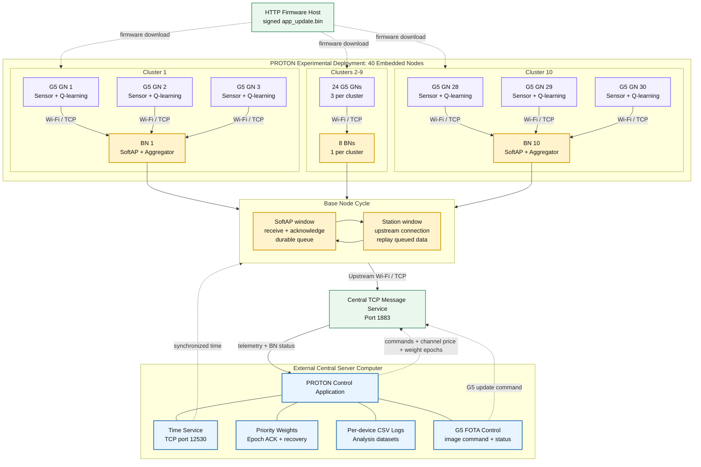

# Semantic-Wifi-Edge

**Semantic-Aware WiFi Data Collection for Smart Manufacturing with AI-Driven
Edge Intelligence**

[](docs/system_architecture.mmd)
[](#software-and-hardware-versions)
[](#software-and-hardware-versions)
[](#ground-node-fota)

PROTON Testbed is a distributed wireless testbed for studying adaptive communication in
energy-constrained IoT networks. The system combines G5 Ground Nodes (GNs),
cluster-level Base Nodes (BNs), a Central Server, and a desktop application for
experiment control and data collection.

The deployment described here contains **40 physical nodes organized into 10
clusters**:

- **30 G5 Ground Nodes (GNs)**: three sensing and learning devices per cluster
- **10 Base Nodes (BNs)**: one communication gateway per cluster
- **1 external Central Server computer**: runs the TCP message service and PROTON desktop
  application; it is not counted as one of the 40 embedded nodes

## System Architecture

The ecosystem uses an upstream hierarchical flow: data originates at the G5
Ground Nodes, is collected by the cluster Base Nodes, and is forwarded to the
Central Server for control, monitoring, and logging.

> On GitHub, the Mermaid diagram below is interactive. Use the diagram toolbar
> to zoom, pan, reset the view, or copy the diagram. The controls appear when
> the pointer is over the rendered diagram.



Download or edit the diagram source:
[system_architecture.mmd](docs/system_architecture.mmd).

This diagram represents the experiment directly: 10 clusters, three G5 Ground
Nodes per cluster, and one Base Node per cluster. Each Base Node receives local
traffic in its SoftAP window, retains it in a durable queue, then changes to
station mode and forwards it upstream. The external Central Server is not part
of the 40-node embedded count. Commands, time, weight recovery, and G5 firmware
updates follow the corresponding return paths.

## Repository Components

The complete project is split into three cooperating codebases.

| Component | Responsibility | Main implementation |
|---|---|---|
| G5 Ground Node (GN) firmware | Sensing, MPPT measurements, Wi-Fi/TCP communication, Q-learning, adaptive packet scheduling, persistent weight epochs, and telemetry | `g5_node_1/` |
| Base Node (BN) firmware | Cluster SoftAP, local TCP message handling, durable buffering, metadata/PRR stamping, STA uplink, and reliable forwarding | `base-node/` |
| PROTON Central Server | TCP service management, time synchronization, telemetry capture, cluster channel-price calculation, weight-epoch acknowledgement, GUI control, and CSV logging | `PROTON-Testbed-gui/` |

The G5 Ground Node and Base Node are different firmware applications. They use
different source trees, board configurations, feature sets, and SDK versions.
A G5 firmware image must never be flashed to a Base Node, and a Base Node image
must never be flashed to a G5 Ground Node.

When these components are published as separate GitHub repositories, replace
the names above with links to the corresponding repositories.

## Component Behavior

### G5 Ground Nodes (GNs)

Every G5 Ground Node:

1. Joins its assigned cluster Base Node.
2. Measures communication and energy state.
3. Builds a discrete Q-learning state from:
   - RSSI
   - Successful Delivery Ratio (SDR)
   - Available Energy
   - Consumed Energy
   - Age of Information (AoI)
   - Photovoltaic Power
4. Selects an action that schedules 15, 20, 25, or 30 packets in the active
   communication phase.
5. Publishes telemetry through a reliable TCP connection.
6. Updates its Q-table from the observed outcome.
7. Persists learning and weight-scheduler state across reboots.

The action-selection policy combines exploration and exploitation. During
exploration, a G5 Ground Node rotates through packet classes. During
exploitation, it uses learned Q-values and the current channel-load price to
select an action.

An energy safety check can force the node to IDLE when its safe-energy budget
is exhausted.

### Base Nodes (BNs)

Each Base Node serves one cluster and time-multiplexes a single Wi-Fi radio:

1. **SoftAP window**
   - Hosts the cluster Wi-Fi network.
   - Accepts TCP connections from three G5 Ground Nodes.
   - Acknowledges reliable application messages.
   - Buffers publications in a durable queue.
   - Adds base-node metadata and packet-based epoch PRR where applicable.
2. **STA window**
   - Connects to the upstream Wi-Fi network.
   - Opens a TCP connection to the Central Server.
   - Replays buffered messages while preserving their routing information.
   - Receives and queues Central Server-to-device commands.
3. Returns to SoftAP mode and delivers queued downlink traffic.

This hierarchy lets multiple clusters share one Central Server while keeping local
ground-node traffic separated by cluster.

### PROTON Central Server

The Central Server application provides:

- TCP message-service startup and shutdown
- telemetry subscription and command publication
- UTC time synchronization over TCP
- automatic G5 Ground Node and Base Node discovery
- per-device and per-cluster status monitoring
- experiment start/stop commands
- cluster-level channel-load price calculation
- strict weight-epoch acknowledgement and recovery
- real-time GUI views
- per-device CSV logs and broker/base-node event logs

Experiment output is stored under:

```text
logs/
+-- log_YYYY-MM-DD_HH-MM-SS/
    +-- node_data_<device-id>.csv
    +-- node_list.txt
    +-- bn_events.csv
    +-- broker_events.csv
    +-- lambda_all.csv
    +-- lambda_cluster_<id>.csv
```

## Priority Weights

Each G5 Ground Node is assigned a device row in three weight matrices:

- `co2_ppm_WA_matrix.csv`: AoI weight
- `co2_ppm_WR_matrix.csv`: PRR weight
- `co2_ppm_WE_matrix.csv`: energy weight

The Q-derived priority value controls the trade-off between information
freshness, packet delivery, and energy conservation.

The Q-matrix `t0` column initializes the system. Operational priority values
begin at `t1`. A high-priority node receives larger AoI and PRR weights and a
smaller energy weight. A lower-priority node places more emphasis on retaining
energy.

Priorities may change from epoch to epoch. This allows the experiment to rotate
high priority among different G5 Ground Nodes instead of permanently favoring one
device.

## Reward and Learning

The reward balances remaining safe energy, action-energy use, information age,
packet delivery, channel load, and reboot status.

- More safe energy generally improves reward.
- More action-energy use reduces reward.
- Higher AoI reduces reward.
- Lower PRR reduces reward.
- Larger packet actions receive a stronger channel-load cost.
- A reboot can add a configurable penalty.

The learning update combines the previous Q-value, the latest reward, and the
best expected value of the next state.

Major learning parameters are:

| Parameter | Purpose | Current default |
|---|---|---:|
| `alpha` | Learning rate | 0.9 |
| `gamma` | Future-reward discount | 0.9 |
| `epsilon` | Exploration probability | 0.4 |
| Channel-load price | Packet-allocation cost | 0.2 initially |
| Price update step | Controls channel-price adjustment | 0.01 |
| `N_max` | Aggregate channel-load target for each cluster | 90 packets |

## Weight-Epoch Reliability

Every telemetry record identifies:

- commissioned weight-device number
- current weight epoch
- AoI, PRR, and energy weights
- scheduler revision
- Central Server acknowledgement state

The Central Server tracks the next expected epoch for every device. If it
detects a gap, it requests the exact missing epoch. The G5 Ground Node holds or
replays that epoch before moving forward. This strict sequence prevents an
out-of-order publication from hiding a missing matrix entry.

## TCP Data Flow

Typical uplink topics:

```text
dt/node-nrf5340/<device-id>/status
dt/node-nrf5340/<device-id>/sys
dt/node-nrf5340/<device-id>/mppt
dt/node-nrf5340/<device-id>/wifi_stats
dt/node-nrf5340/<device-id>/ota_dfu_status
```

Typical downlink topics:

```text
cmd/node-nrf5340/<device-id>/reboot
cmd/node-nrf5340/<device-id>/ota_dfu
cmd/node-nrf5340/<device-id>/fs
cmd/node-nrf5340/<device-id>/remote_pub
cmd/node-nrf5340/<device-id>/node_id
```

Application telemetry and commands use TCP port `1883` with reliable
acknowledgement. The time service uses TCP port `12530`.

## Ground Node FOTA

G5 Ground Nodes support Firmware Over-The-Air (FOTA) updates using MCUboot and
the signed `app_update.bin` produced by the G5 release build.

The implemented update sequence is:

1. Build and host the signed G5 `app_update.bin` on an HTTP server reachable by
   the selected G5 Ground Nodes.
2. Select the target devices in the PROTON Central Server application.
3. The application sends each device a FOTA command containing a session ID,
   image host, filename, retry count, and installation mode.
4. The G5 Ground Node pauses routine telemetry publishers and downloads the
   image into the MCUboot update slot.
5. The device reports download progress, completion, cancellation, or an error
   through its FOTA status channel.
6. With installation mode `now`, the device reboots after the download and
   MCUboot starts the new image. Modes `later` and `manual` defer installation
   until a later reboot.
7. After a successful boot, the G5 application confirms the running image so
   MCUboot does not revert it on the following restart.

Use a unique session ID for a new deployment. A G5 Ground Node stores the last
accepted session ID and ignores a duplicate request. Keep the node powered and
its Wi-Fi path stable for the entire download.

The current Base Node build also uses MCUboot with an external secondary image
slot, but it is a separate NCS 3.0.2 firmware application. The G5 FOTA command
path documented above targets G5 Ground Nodes; it must not be treated as a Base
Node firmware updater. Build and service Base Node firmware independently.

## Prerequisites

### Software and Hardware Versions

- **G5 Ground Node:** Nordic nRF Connect SDK 2.5.0
- **Base Node:** Nordic nRF Connect SDK 3.0.2 with sysbuild and MCUboot
- nRF Connect for VS Code
- west, CMake, and Ninja supplied by the matching NCS toolchain
- compatible nRF5340/nRF7002-based G5 Ground Node and Base Node hardware

Do not build both applications from one inherited terminal environment. Open
the terminal for the required NCS version, verify the active toolchain, and
then build only that firmware workspace.

### Central Server

- Windows computer connected to the experiment network
- Python 3
- the project's TCP message service
- Python packages required by the Central Server repository

Do not commit Wi-Fi passwords, broker credentials, certificates, or device
secrets. Store deployment-specific values in local configuration.

## Build and Run

### Build the G5 Ground Node Firmware

Open an NCS 2.5.0 terminal in `g5_node_1/`.

```powershell
west build -p always -b heliogen_g5_node_nrf5340_cpuapp -d build .
```

Within VS Code, the repository also provides the default task:

```text
G5: Build with NCS 2.5.0
```

Build artifacts include:

```text
build/zephyr/merged.hex
build/zephyr/app_update.bin
```

### Build a Base Node

Open an **NCS 3.0.2** terminal in `base-node/`. This is not the NCS 2.5.0
environment used for G5 Ground Nodes.

Set the cluster ID independently for each of the ten Base Nodes:

```powershell
west build -p always -b proton_node/nrf5340/cpuapp --sysbuild -d build -- -DCONFIG_BN_CLUSTER_ID=1
```

Repeat with cluster IDs `1` through `10`, then flash the corresponding firmware
to each Base Node.

### Start an Experiment

1. Configure and power the ten Base Nodes.
2. Start the upstream Wi-Fi network.
3. Allow inbound TCP ports `1883` and `12530` on the Central Server.
4. Start the PROTON desktop application:

   ```powershell
   python proton_testbed.py
   ```

5. Start the Central Server from the GUI.
6. Power the 30 G5 Ground Nodes.
7. Confirm discovery of 10 Base Nodes and 30 G5 Ground Nodes.
8. Start log capture.
9. Run the experiment and stop the Central Server cleanly to flush all CSV files.

## Recommended Experiment Validation

For every run, verify:

- 10 clusters are visible.
- each cluster has one Base Node and three G5 Ground Nodes.
- all 30 G5 Ground Node device IDs are unique.
- each device uses its commissioned weight-device row.
- expected weight epochs are present and sequential.
- logged weights match the configured matrix.
- PRR equals received packets divided by intended packets.
- rewards are aligned with the correct outcome and weight epoch.
- Base Node queues drain without drops.
- all CSV files close cleanly at shutdown.

## Known Implementation Considerations

- Telemetry may display a reward one cycle after the outcome that generated it.
- Priority weights affect the reward objective; they do not directly command a
  particular packet action.
- The Q-learning state does not currently include the priority class.
- Energy, AoI, PRR, exploration, channel price, phase selection, and learned
  Q-values all influence the selected action.
- Analysis should distinguish total class load from per-device load when class
  sizes differ.

## Citation

If you use this system, firmware, or experiment design in academic work, cite:

GitHub can generate the citation automatically from
[`CITATION.cff`](CITATION.cff). The equivalent BibTeX entry is:

```bibtex
@software{semantic_wifi_edge_2026,
  author    = {Nimmagadda, Sai Harsha and Chakraborty, Debaleena and
               Sharma, Pragya and Chakrabarty, Krishnendu and
               Tsiropoulou, Eirini Eleni},
  title     = {Semantic-Wifi-Edge},
  year      = {2026},
  publisher = {GitHub},
  note      = {G5 Ground Node, Base Node, and Central Server software}
}
```

